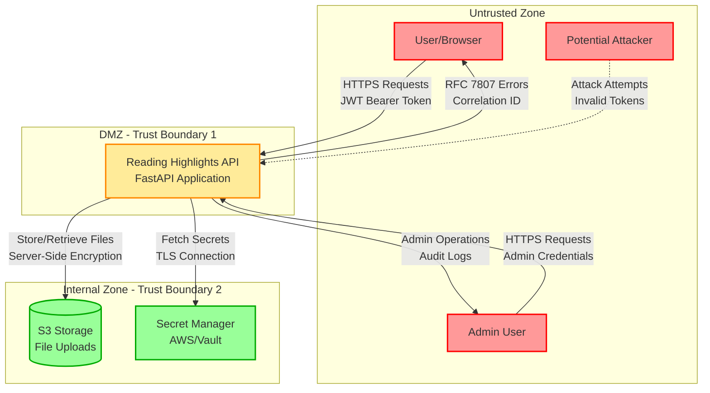

# DFD Level 0: Context Diagram

Контекстная диаграмма показывает систему как единое целое и её взаимодействие с внешними сущностями.

## Границы доверия

### TB-1: Internet → DMZ
- **Защита:** HTTPS/TLS, аутентификация JWT, ограничение частоты запросов
- **Угрозы:** MITM, повторные атаки, перебор учетных данных, DDoS
- **Контроли:**
  - Проверка подписи JWT (HS256)
  - Ограничение запросов (10 req/min для highlights, 5 req/min для auth)
  - Валидация ввода (схемы Pydantic)
  - Политики CORS

### TB-2: DMZ → Internal Zone
- **Защита:** Аутентификация сервисов, роли IAM, шифрование
- **Угрозы:** Боковое перемещение, утечка данных, повышение привилегий
- **Контроли:**
  - Серверное шифрование S3 (AES256)
  - Доступ на основе ролей IAM
  - TLS-соединения с Secret Manager
  - Сегментация сети

## Потоки данных

| Поток | Источник | Назначение | Данные | Безопасность |
|-------|----------|------------|--------|---------------|
| DF-1 | Пользователь | API | Учетные данные (username/password) | HTTPS, ограничение запросов |
| DF-2 | API | Пользователь | JWT токены (access + refresh) | HTTPS, HttpOnly cookies |
| DF-3 | Пользователь | API | CRUD операции с highlights | HTTPS, JWT Bearer auth |
| DF-4 | API | S3 | Загрузка файлов (изображения) | TLS, шифрование AES256 |
| DF-5 | API | Secret Manager | Получение секретов | TLS, IAM auth |
| DF-6 | API | Пользователь | Ошибки RFC 7807 | HTTPS, скрытые детали |

## Контроли безопасности по зонам

### Недоверенная зона (Untrusted Zone)
- Отсутствие предположений о доверии
- Весь ввод считается враждебным
- Валидация на стороне клиента опциональна

### DMZ (уровень API)
- Валидация JWT при каждом запросе
- Проверки авторизации на основе владельца
- Отслеживание Correlation ID
- Структурированное логирование (секреты скрыты)
- Ограничение запросов по IP/пользователю

### Внутренняя зона (Internal Zone)
- Шифрование в покое (S3)
- Шифрование при передаче (TLS)
- Доступ только через служебные учетные записи
- Включено аудит-логирование
