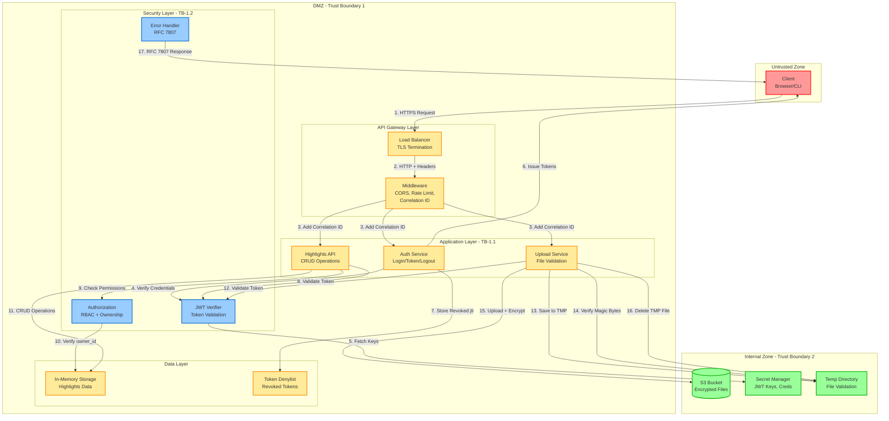

# DFD Level 1: Application Decomposition

Декомпозиция приложения на основные компоненты с границами доверия.

## Границы доверия

### TB-1: Internet → DMZ (API Gateway)
**Точка пересечения:** Load Balancer с TLS-терминацией

**Контроли:**
- Только HTTPS/TLS 1.3
- Ограничение запросов по IP (middleware)
- Применение политик CORS
- Ограничение размера запроса (5MB)
- Защита от таймаутов (30s)

**Валидация данных:**
- Все запросы проверяются схемами Pydantic
- Параметры запроса санитаризированы
- Предотвращение инъекций в заголовки

### TB-1.1: API Gateway → Application Layer
**Точка пересечения:** Middleware → Бизнес-логика

**Контроли:**
- Внедрение Correlation ID
- Логирование запросов (секреты скрыты)
- Аутентификация требуется для защищенных маршрутов
- Санитаризация ввода (удаление HTML/скриптов)

**Проверки авторизации:**
- Проверка подписи JWT
- Валидация срока действия токена
- Допуск рассинхронизации часов (±60s)

### TB-1.2: Application Layer → Security Layer
**Точка пересечения:** Бизнес-логика → Авторизация

**Контроли:**
- Применение RBAC (роли user/admin)
- Контроль доступа на основе владельца (фильтрация owner_id)
- Проверка scope (если присутствует)
- Политика запрета по умолчанию

**Предотвращенные антипаттерны:**
- Insecure Direct Object Reference (IDOR)
- Повышение привилегий
- Горизонтальные нарушения доступа

### TB-2: DMZ → Internal Zone
**Точка пересечения:** Приложение → Внешние сервисы

**Контроли:**
- Аутентификация служебных учетных записей (IAM)
- TLS для всех внешних соединений
- Поддержка ротации секретов (текущий + предыдущий ключ)
- Аудит-логирование

**Защита данных:**
- S3: Серверное шифрование (AES256)
- Секреты: Шифрование в покое и при передаче
- TMP-файлы: Канонические пути, предотвращение symlink

## Хранилища данных

### DS-1: Хранилище в памяти
- **Тип:** Python dict (только demo/dev)
- **Чувствительность:** Средняя (заметки пользователей)
- **Доступ:** Только через класс Storage
- **Защита:** Фильтрация owner_id во всех запросах

### DS-2: Denylist токенов
- **Тип:** Python set (в памяти)
- **Чувствительность:** Высокая (отозванные токены)
- **Доступ:** Только модуль JWT
- **Очистка:** Периодическая очистка устаревших записей

### DS-3: S3 Bucket
- **Тип:** Объектное хранилище
- **Чувствительность:** Средняя (загруженные файлы)
- **Доступ:** Через boto3 с IAM-креденшелами
- **Защита:**
  - Серверное шифрование (AES256)
  - UUID-ключи (без контроля пользователем)
  - Pre-signed URL для получения (будущее)

### DS-4: Secret Manager
- **Тип:** AWS Secrets Manager / Vault
- **Чувствительность:** Критическая (JWT-ключи, креденшелы)
- **Доступ:** Только чтение через TLS
- **Ротация:** Поддержка двух ключей (текущий + предыдущий)

## Безопасность процессов

### P-1: Сервис аутентификации
- **Уровень доверия:** Средний
- **Ввод:** Имя пользователя, пароль, refresh-токен
- **Валидация:** Проверка креденшелов по демо-пользователям
- **Вывод:** JWT-токены (access + refresh)
- **Ограничение запросов:** 5 req/min по IP
- **Аудит:** Попытки входа логируются

### P-2: Highlights API
- **Уровень доверия:** Средний
- **Ввод:** JWT Bearer-токен, данные заметок
- **Валидация:** Подпись токена, совпадение owner_id
- **Вывод:** Результаты CRUD
- **Ограничение запросов:** 10 req/min по IP (только POST)
- **Аудит:** Все операции логируются с correlation_id

### P-3: Сервис загрузки
- **Уровень доверия:** Низкий (обрабатывает файлы пользователей)
- **Ввод:** JWT-токен, байты файла
- **Валидация:**
  - Magic bytes vs MIME-тип
  - Размер файла ≤ 5MB
  - Предотвращение path traversal
  - Обнаружение symlink
- **Вывод:** Ключ S3-объекта
- **Ограничение запросов:** 3 req/min на пользователя
- **Аудит:** События загрузки с хешем файла

### P-4: Проверщик JWT
- **Уровень доверия:** Высокий (контроль безопасности)
- **Ввод:** JWT-строка
- **Валидация:**
  - Подпись с SECRET_KEY + SECRET_KEY_PREV
  - Срок действия (с допуском ±60s)
  - Issuer/Audience claims
  - Refresh token denylist
- **Вывод:** Payload токена или ошибка
- **Побочные эффекты:** Отсутствуют (stateless)

### P-5: Авторизация
- **Уровень доверия:** Высокий (контроль безопасности)
- **Ввод:** Payload токена, owner_id ресурса
- **Валидация:**
  - Проверка роли (user/admin)
  - Проверка scope (если определен)
  - Совпадение owner_id (кроме admin)
- **Вывод:** Решение Allow/Deny
- **Поведение:** 404 при неавторизованном доступе (анти-перечисление)

## Анализ поверхности атак

### Точки входа
1. **POST /auth/login** - Риск перебора креденшелов
2. **POST /auth/token** - Риск повтора токена
3. **POST /highlights** - Риск инъекций, DoS
4. **POST /upload** (будущее) - Атаки через загрузку файлов
5. **GET /highlights/{id}** - Риск IDOR

### Примененные митигации
- Ограничение запросов на всех точках входа
- Проверка подписи JWT
- Фильтрация по владельцу
- Валидация ввода (Pydantic)
- Проверка magic bytes
- Канонизация путей
- Формат ошибок RFC 7807 (без утечки информации)
