# DFD Level 2: Authentication Flow

Детальная декомпозиция процесса аутентификации с границами доверия.

```mermaid
graph TB
    subgraph "Untrusted Zone"
        User[User]
    end

    subgraph "DMZ - Trust Boundary 1"
        subgraph "Entry Point"
            RateLimiter[Rate Limiter<br/>5 req/min per IP]
            CorrelationID[Correlation ID<br/>Generator]
        end

        subgraph "Auth Endpoints - TB-1.1"
            LoginEP[POST /auth/login<br/>Credentials Input]
            TokenEP[POST /auth/token<br/>Refresh Token Input]
            LogoutEP[POST /auth/logout<br/>Token Revocation]
        end

        subgraph "Authentication Logic - TB-1.2"
            CredValidator[Credential Validator<br/>Demo Users Check]
            TokenIssuer[Token Issuer<br/>JWT Generation]
            TokenVerifier[Token Verifier<br/>Signature Check]
            RefreshHandler[Refresh Handler<br/>Token Rotation]
        end

        subgraph "Security Components - TB-1.3"
            JWTEncoder[JWT Encoder<br/>HS256 Signing]
            JWTDecoder[JWT Decoder<br/>Signature Verification]
            ClockSkew[Clock Skew Handler<br/>±60s Tolerance]
            DenylistCheck[Denylist Checker<br/>Revoked JTI]
        end

        subgraph "Data Stores"
            DemoUsers[(Demo Users<br/>username:password)]
            Denylist[(Token Denylist<br/>Revoked JTI Set)]
        end
    end

    subgraph "Internal Zone - Trust Boundary 2"
        SecretMgr[Secret Manager<br/>JWT Keys]
        AuditLog[Audit Log<br/>Auth Events]
    end

    User -->|1. POST credentials| RateLimiter
    RateLimiter -->|2. Check limit| LoginEP
    RateLimiter -.->|Rate exceeded| User

    LoginEP -->|3. Generate UUID| CorrelationID
    LoginEP -->|4. Validate credentials| CredValidator
    CredValidator -->|5. Lookup user| DemoUsers
    CredValidator -.->|Invalid| LoginEP

    CredValidator -->|6. User found| TokenIssuer
    TokenIssuer -->|7. Fetch SECRET_KEY| SecretMgr
    TokenIssuer -->|8. Generate payload| JWTEncoder

    JWTEncoder -->|9. Sign with HS256| TokenIssuer
    TokenIssuer -->|10. Return tokens| User
    TokenIssuer -->|11. Log success| AuditLog

    User -->|12. Refresh request| TokenEP
    TokenEP -->|13. Verify signature| TokenVerifier
    TokenVerifier -->|14. Decode JWT| JWTDecoder
    JWTDecoder -->|15. Fetch keys| SecretMgr
    JWTDecoder -->|16. Check exp + iat| ClockSkew

    TokenVerifier -->|17. Check revocation| DenylistCheck
    DenylistCheck -->|18. Lookup JTI| Denylist
    DenylistCheck -.->|Revoked| TokenEP

    TokenVerifier -->|19. Valid token| RefreshHandler
    RefreshHandler -->|20. Issue new tokens| TokenIssuer
    RefreshHandler -->|21. Revoke old JTI| Denylist
    RefreshHandler -->|22. Return new tokens| User

    User -->|23. Logout request| LogoutEP
    LogoutEP -->|24. Verify access token| TokenVerifier
    LogoutEP -->|25. Extract refresh JTI| RefreshHandler
    LogoutEP -->|26. Add to denylist| Denylist
    LogoutEP -->|27. Log logout| AuditLog

    classDef untrusted fill:#ff9999,stroke:#ff0000,stroke-width:2px
    classDef entry fill:#ffeb99,stroke:#ff8800,stroke-width:2px
    classDef logic fill:#ffffcc,stroke:#ffaa00,stroke-width:2px
    classDef security fill:#99ccff,stroke:#0066cc,stroke-width:2px
    classDef data fill:#cccccc,stroke:#666666,stroke-width:2px
    classDef internal fill:#99ff99,stroke:#00aa00,stroke-width:2px

    class User untrusted
    class RateLimiter,CorrelationID entry
    class LoginEP,TokenEP,LogoutEP,CredValidator,TokenIssuer,TokenVerifier,RefreshHandler logic
    class JWTEncoder,JWTDecoder,ClockSkew,DenylistCheck security
    class DemoUsers,Denylist data
    class SecretMgr,AuditLog internal
```



## Анализ границ доверия

### TB-1: Untrusted → Rate Limiter
**Угроза:** DDoS, перебор креденшелов, brute force

**Контроли:**
- Ограничение запросов: 5 запросов/минуту на IP
- Скользящее окно в памяти
- Возврат 429 Too Many Requests при нарушении

**Валидация:**
- Извлечение IP из X-Forwarded-For (только первый IP)
- Истечение по временной метке
- Периодическая очистка старых записей

### TB-1.1: Rate Limiter → Auth Endpoints
**Угроза:** Неверный ввод, инъекции

**Контроли:**
- Валидация схемы Pydantic
- Максимальный размер тела запроса: 1KB
- Проверка Content-Type (application/json)

**Поток данных:**
```python
# Login Request
{
  "username": str (max 100 chars),
  "password": str (max 100 chars)
}

# Refresh Request
{
  "refresh_token": str (JWT format)
}
```

### TB-1.2: Auth Endpoints → Authentication Logic
**Угроза:** Обход логики, повышение привилегий

**Контроли:**
- Stateless-валидация (без состояния сессии)
- Сравнение за постоянное время для креденшелов
- Отсутствие перечисления пользователей (общие сообщения об ошибках)

**Свойства безопасности:**
- **Конфиденциальность:** Пароли никогда не логируются
- **Целостность:** Подпись JWT предотвращает изменения
- **Доступность:** Ограничение запросов предотвращает злоупотребления

### TB-1.3: Authentication Logic → Security Components
**Угроза:** Криптографические атаки, timing-атаки

**Контроли:**
- Только алгоритм HS256 (без путаницы алгоритмов)
- Секретный ключ минимум 256 бит
- Допуск рассинхронизации часов: ±60 секунд
- Поддержка двух ключей для ротации

**Структура JWT Payload:**
```json
{
  "iss": "reading-highlights-api",
  "aud": "reading-highlights-api",
  "sub": "user-uuid",
  "iat": 1698765432,
  "exp": 1698766332,
  "jti": "token-uuid",
  "role": "user|admin",
  "scopes": ["optional"]
}
```

### TB-2: DMZ → Internal Zone
**Угроза:** Утечка секретов, боковое перемещение

**Контроли:**
- Только TLS-соединения с Secret Manager
- Доступ только на чтение (без прав записи)
- Секреты кешируются в памяти (не сохраняются на диск)
- Аудит-логирование всех обращений к секретам

## Детали процессов

### P-1: Поток входа (Login)
1. **Ввод:** username + password (открытый текст по HTTPS)
2. **Валидация:** Проверка по словарю демо-пользователей
3. **Вывод:** Access token (15мин) + Refresh token (7 дней)
4. **Побочные эффекты:** Запись в аудит-лог с correlation_id
5. **Случаи ошибок:**
   - Неверные креденшелы → 401 Unauthorized
   - Превышение лимита → 429 Too Many Requests
   - Отсутствующие поля → 422 Validation Error

### P-2: Поток обновления токена (Token Refresh)
1. **Ввод:** Refresh token (JWT-строка)
2. **Валидация:**
   - Проверка подписи с SECRET_KEY + SECRET_KEY_PREV
   - Проверка срока действия (с допуском ±60с)
   - Поле type должно быть "refresh"
   - JTI не должен быть в denylist
3. **Вывод:** Новые access + refresh токены
4. **Побочные эффекты:**
   - JTI старого refresh-токена добавляется в denylist
   - Запись в аудит-лог
5. **Случаи ошибок:**
   - Неверная подпись → 401 Unauthorized
   - Истекший токен → 401 Token Expired
   - Отозванный токен → 401 Token Revoked
   - Неверный тип токена → 400 Bad Request

### P-3: Поток выхода (Logout)
1. **Ввод:** Access token (для аутентификации) + Refresh token (для отзыва)
2. **Валидация:** Подпись access token
3. **Вывод:** Сообщение об успехе
4. **Побочные эффекты:**
   - JTI refresh-токена добавляется в denylist
   - Запись в аудит-лог
5. **Случаи ошибок:**
   - Неверный access token → 401 Unauthorized
   - Уже отозван → 200 OK (идемпотентно)

## Матрица контролей безопасности

| Контроль | Login | Refresh | Logout | Эффективность |
|---------|-------|---------|--------|---------------|
| Rate Limiting |  5/мин |  5/мин | x N/A | Высокая |
| JWT Signature |  Выпуск |  Проверка |  Проверка | Критическая |
| Clock Skew |  Set iat |  Check exp | x N/A | Средняя |
| Denylist | x N/A |  Проверка |  Добавление | Высокая |
| Audit Log |  Всегда |  Всегда |  Всегда | Средняя |
| Input Validation |  Pydantic |  Pydantic |  Pydantic | Высокая |
| Secret Rotation |  Текущий ключ |  Двойной ключ | x N/A | Высокая |

## Сценарии атак и меры защиты

### AS-1: Credential Stuffing
**Атака:** Автоматизированные попытки входа с утекшими креденшелами
**Защита:**
- Rate limit: 5 попыток/минуту на IP
- Отсутствие перечисления пользователей (одинаковая ошибка для неверного пользователя/пароля)
- Аудит-логирование для форензики

### AS-2: Token Replay
**Атака:** Повторное использование украденного access token
**Защита:**
- Короткий TTL (15 минут)
- Только HTTPS (предотвращает MITM)
- Correlation ID для отслеживания

**Примечание:** Refresh-токены могут быть отозваны через denylist

### AS-3: JWT Algorithm Confusion
**Атака:** Изменение алгоритма на 'none' или RS256 без ключа
**Защита:**
- Жестко заданная проверка алгоритма (только HS256)
- Библиотека PyJWT валидирует алгоритм

### AS-4: Clock Skew Exploitation
**Атака:** Использование истекшего токена с манипуляцией часов
**Защита:**
- Только серверное время (время клиента игнорируется)
- Ограниченное окно допуска (±60с)
- Строгий контроль истечения

### AS-5: Secret Key Compromise
**Атака:** Украденный SECRET_KEY используется для подделки токенов
**Защита:**
- Ротация с двумя ключами (текущий + предыдущий)
- Secret Manager с audit trail
- Автоматическая ротация ключей (например, каждые 90 дней)

## События аудита

Все события аутентификации логируются со следующими полями:
- `correlation_id`: UUID запроса
- `event_type`: login_success, login_failure, token_refresh, logout
- `user_id`: Subject из токена (если доступен)
- `ip_address`: IP клиента (последний октет замаскирован в логах)
- `timestamp`: Формат ISO 8601
- `user_agent`: Идентификатор клиента
- `outcome`: success / failure

**Маскировка секретов:**
- Пароли никогда не логируются
- Токены логируются как `***` (только первые/последние 4 символа в режиме отладки)
- SECRET_KEY никогда не логируется
