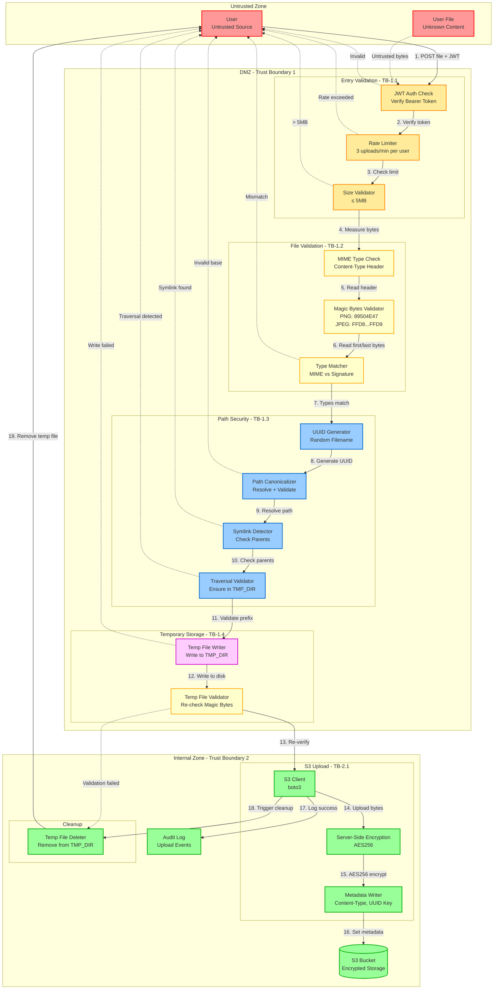

# DFD Уровень 3: Поток загрузки файлов

Детальная декомпозиция процесса загрузки файлов с акцентом на безопасность.



## Анализ границ доверия

### TB-1: Untrusted → Entry Validation
**Угроза:** Вредоносные файлы, DoS, несанкционированный доступ

**Контроли:**
- JWT-аутентификация (требуется Bearer token)
- Ограничение запросов: 3 загрузки/минуту на пользователя (sub claim)
- Ограничение размера: максимум 5МБ (5,000,000 байт)
- Только HTTPS (байты файла шифруются при передаче)

**Валидация:**
```python
# Структура запроса
POST /upload
Authorization: Bearer <jwt>
Content-Type: multipart/form-data
Body: file bytes (≤ 5MB)
```

### TB-1.1: Entry Validation → File Validation
**Угроза:** Путаница типов файлов, полиглот-атаки

**Контроли:**
- Проверка MIME-типа (заголовок Content-Type)
- Валидация magic bytes (первые 8 байт для PNG, первые 2 + последние 2 для JPEG)
- Сопоставление типов (MIME должен соответствовать сигнатуре)

**Сигнатуры Magic Bytes:**
```python
PNG:  b'\x89PNG\r\n\x1a\n'  # Первые 8 байт
JPEG: b'\xff\xd8' ... b'\xff\xd9'  # Начальный + конечный маркеры
```

**Отклоняемые типы:**
- SVG (может содержать скрипты)
- GIF (сложность анимации)
- WEBP (менее распространен, сложнее валидировать)
- Любые неизображения

### TB-1.2: File Validation → Path Security
**Угроза:** Path traversal, атаки через symlink, произвольная запись файлов

**Контроли:**
- Генерация имени файла UUID v4 (без пользовательского ввода)
- Канонизация пути (`Path.resolve(strict=True)`)
- Проверка родительских директорий на symlink
- Валидация префикса (файл должен быть внутри TMP_DIR)

**Логика валидации пути:**
```python
# 1. Канонизация базовой директории
root = Path(TMP_DIR).resolve(strict=True)

# 2. Генерация безопасного имени файла
safe_name = f"{uuid4()}.{ext}"

# 3. Построение целевого пути
target = (root / safe_name).resolve()

# 4. Проверка отсутствия traversal
if not str(target).startswith(str(root)):
    raise SecurityError("path_traversal_detected")

# 5. Проверка отсутствия symlinks в цепочке родителей
for parent in target.parents:
    if parent.is_symlink():
        raise SecurityError("symlink_in_path")
    if parent == root:
        break
```

### TB-1.3: Path Security → Temporary Storage
**Угроза:** Состояния гонки, исчерпание диска, несанкционированный доступ к файлам

**Контроли:**
- TMP_DIR с ограниченными правами (700)
- Атомарная операция записи
- Проверка дискового пространства перед записью
- Тайм-аут: 30 секунд на всю загрузку

**Свойства временного файла:**
- **Расположение:** Только в TMP_DIR (переменная окружения)
- **Права доступа:** Только чтение/запись пользователя (600)
- **Время жизни:** Удаляется сразу после загрузки в S3
- **Назначение:** Только валидация, никогда не раздается напрямую

### TB-1.4: Temporary Storage → S3 Upload
**Угроза:** Эксфильтрация данных, утечка метаданных

**Контроли:**
- Аутентификация через IAM-роль S3 (без захардкоженных ключей в dev)
- TLS 1.2+ для соединений с S3
- Серверное шифрование (AES256)
- UUID-ключи объектов (без утечки имени файла)

**Структура S3-объекта:**
```python
{
  "Bucket": "highlights-uploads",
  "Key": f"{uuid4()}.{ext}",  # Новый UUID, не имя временного файла
  "Body": file_bytes,
  "ContentType": mime_type,  # image/png или image/jpeg
  "ServerSideEncryption": "AES256",
  "Metadata": {
    "uploaded_by": user_sub,
    "correlation_id": request_correlation_id,
    "original_size": str(file_size)
  }
}
```

### TB-2: DMZ → Internal Zone (S3)
**Угроза:** Кража учетных данных, перечисление bucket'ов, несанкционированный доступ

**Контроли:**
- Доступ на основе IAM-ролей (EC2/ECS instance profile)
- Политика S3 bucket: запрет публичного доступа
- Шифрование в состоянии покоя (ключи, управляемые S3)
- VPC endpoint для S3 (без роутинга через интернет в продакшене)

**Политика S3 Bucket:**
```json
{
  "Effect": "Deny",
  "Principal": "*",
  "Action": "s3:*",
  "Resource": "arn:aws:s3:::highlights-uploads/*",
  "Condition": {
    "Bool": { "aws:SecureTransport": "false" }
  }
}
```

## Сценарии атак и меры защиты

### AS-1: Полиглот-атака файлом
**Атака:** Файл с валидным заголовком PNG, но исполняемым кодом в теле

**Защита:**
- Валидация magic bytes (требуется сигнатура PNG)
- Отсутствие исполнения загруженных файлов
- Файлы хранятся в S3, а не в web root
- Content-Type заголовок установлен явно (без browser sniffing)

**Пример блокировки:**
```
Файл: malicious.png
Заголовок: \x89PNG\r\n\x1a\n (валиден)
Тело: <?php system($_GET['cmd']); ?> (игнорируется)
Результат: Файл принят, но никогда не выполняется (только хранение в S3)
```

### AS-2: Path Traversal через имя файла
**Атака:** Загрузить файл с именем `../../etc/passwd` для перезаписи системных файлов

**Защита:**
- Имя файла, предоставленное пользователем, полностью игнорируется
- UUID v4 генерируется на стороне сервера
- Канонизация пути обеспечивает префикс TMP_DIR

**Пример блокировки:**
```python
# Пользователь отправляет: filename="../../etc/passwd"
# Сервер генерирует: f"{uuid4()}.png" → "a3f2e8d1-4b7c-9a0f-3d2e-5c8b1a9f4e3d.png"
# Путь: /tmp/uploads/a3f2e8d1-4b7c-9a0f-3d2e-5c8b1a9f4e3d.png
# Проверка: str(path).startswith("/tmp/uploads") → True
```

### AS-3: Symlink-атака
**Атака:** Создать symlink в TMP_DIR, указывающий на `/etc/shadow`

**Защита:**
- Проверка всех родительских директорий на symlink
- Отклонение, если любой родитель — symlink
- Сам TMP_DIR должен быть реальной директорией (strict=True)

**Пример блокировки:**
```python
# Атакующий создает: /tmp/uploads/link → /etc
# Целевой путь: /tmp/uploads/link/shadow
# Проверка: Path("/tmp/uploads/link").is_symlink() → True
# Результат: SecurityError("symlink_in_path")
```

### AS-4: Подделка Magic Bytes
**Атака:** Переименовать `.exe` в `.png` и добавить в начало PNG-заголовок

**Защита:**
- Полная валидация magic bytes (8 байт для PNG)
- JPEG требует как начальный маркер (FFD8), так и конечный маркер (FFD9)
- MIME-тип должен соответствовать обнаруженной сигнатуре

**Пример блокировки:**
```
Файл: virus.exe.png
Заголовок: \x89PNG\r\n\x1a\n (8 байт)
Тело: MZ.... (EXE-сигнатура)
Проверка: Чтение всего файла, верификация структуры PNG
Результат: Отклонено (невалидный формат PNG)
```

### AS-5: ZIP Bomb / DoS
**Атака:** Загрузить файл размером 5МБ, который распаковывается в 5ГБ

**Защита:**
- Декомпрессия не выполняется
- Файл хранится как есть в S3
- Ограничение размера применяется к загруженным байтам (5МБ)
- Тайм-аут: 30 секунд на всю операцию

### AS-6: XXE через SVG
**Атака:** Загрузить SVG с ссылкой на внешнюю сущность

**Защита:**
- SVG отсутствует в списке разрешенных типов
- Принимаются только PNG и JPEG
- Валидация magic bytes отклоняет сигнатуру SVG

## Безопасность потока данных

### Пошаговая валидация

| Шаг | Компонент | Вход | Валидация | Выход | Сбой |
|------|-----------|-------|------------|--------|---------|
| 1 | AuthCheck | JWT token | Подпись, срок действия | user_sub | 401 Unauthorized |
| 2 | RateLimiter | user_sub | Лимит 3/мин | Pass/Block | 429 Too Many Requests |
| 3 | SizeCheck | Байты файла | len(bytes) ≤ 5МБ | Pass/Block | 413 Payload Too Large |
| 4 | MIMECheck | Content-Type | Должен быть image/* | mime_type | 400 Invalid Type |
| 5 | MagicBytes | Первые/последние байты | Сигнатура PNG или JPEG | signature | 400 Invalid Signature |
| 6 | TypeMatcher | MIME + сигнатура | Должны совпадать | ext | 400 Type Mismatch |
| 7 | UUIDGen | Нет | Генерация v4 | uuid_name | N/A |
| 8 | PathCanon | TMP_DIR + uuid | Resolve, strict | canonical_path | 500 Invalid Dir |
| 9 | SymlinkCheck | Родительские пути | Нет symlinks | Pass/Block | 403 Symlink Detected |
| 10 | TraversalCheck | Канонический путь | Совпадение префикса | Pass/Block | 403 Traversal Detected |
| 11 | TmpWriter | Байты + путь | Атомарная запись | file_path | 500 Write Failed |
| 12 | TmpValidator | Путь к файлу | Повторная проверка magic | Pass/Block | 500 Validation Failed |
| 13 | S3Client | Путь к файлу | Загрузка TLS | s3_key | 500 Upload Failed |
| 14 | Encryptor | S3-объект | Шифрование AES256 | encrypted_obj | N/A (управляется S3) |
| 15 | TmpDelete | Путь к файлу | Удаление файла | Нет | Логируется (некритично) |

## Производительность и управление ресурсами

### Ограничения ресурсов
- **Максимум одновременных загрузок:** 10 на инстанс
- **Тайм-аут загрузки:** 30 секунд
- **Ограничение запросов:** 3 загрузки/минуту на пользователя
- **Дисковое пространство:** TMP_DIR максимум 1ГБ (требуется мониторинг)
- **Память:** Файл загружается частями (не весь в RAM)

### Стратегия очистки
- **Успех:** TMP-файл удаляется немедленно
- **Ошибка:** TMP-файл удаляется в обработчике очистки
- **Периодически:** Сканирование TMP_DIR каждый час, удаление файлов старше 1 часа
- **При запуске:** Очистка всех файлов в TMP_DIR при старте приложения

## Аудит и мониторинг

### Логируемые события
- `upload_started`: Пользователь, размер файла, correlation_id
- `upload_validated`: Проверка magic bytes пройдена
- `upload_s3_success`: S3 ключ, длительность загрузки
- `upload_failed`: Причина, correlation_id
- `tmp_cleanup`: Количество удаленных файлов

### Метрики
- Процент успешных загрузок (цель: >99%)
- Средняя длительность загрузки (p95 < 5с)
- Нарушения rate limit в час
- Ошибки загрузки S3 в час
- Использование диска TMP_DIR

### Алерты
- Нарушения rate limit > 100/час → Возможная атака
- Ошибки загрузки > 10/час → Проблемы подключения к S3
- Использование TMP_DIR > 80% → Сбой очистки
- Обнаружения symlink > 1/день → Активная попытка атаки
